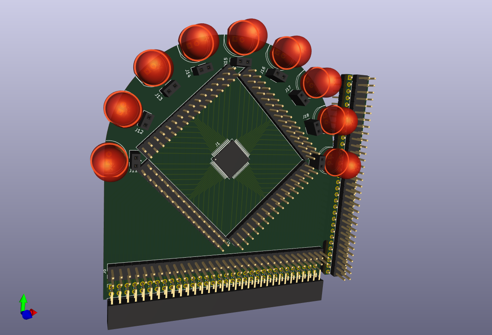

# Igloo64 #

PCB design to adapt a 64-pin TQFP part to a standard solderless breadboard.

## The Problem ##

Many modern chips are only available in surface-mount packages.
Some have the audacity to have 64 pins, and not only that, pins on all four sides.
How can we make such a heinous package fit onto a standard solderless breadboard?

## The Solution ##

This PCB design mounts the SMD part on a vertical board that plugs into a second board
that fits on the breadboard.
The vertical board has a rounded top, reminiscent of an igloo, hence the name.

## KiCad ##

This design has been created using the Open Source CAD package KiCad, V8.0.

To install it on Ubuntu Linux:

`sudo add-apt-repository ppa:kicad/kicad-8.0-releases`

`sudo apt update`

`sudo apt install kicad`

I'm using Ubuntu 22.04 LTS which would give me the very outdated KiCad V6.0 by default.
As I write this, the latest KiCad is V8.0.5,
which is a big upgrade from the V6.0 which I started with.

## PCB Screenshot ##
Work-in-progress, showing routed tracks.
The main TQFP footprint and the four connectors surrounding it have been rotated by
45 degrees before the tracks were routed to the connectors at the bottom.
Those tracks are still a bit uneven, but they all connect correctly.
Space at the curved top of the board may be adorned with LEDs,
the bigger the better.

## PCB 3D Render ##
KiCad's 3D rendering of the PCB as it is so far.
The portion on the right-hand side will be snapped off using mouse-bites and used
to connect the main board to the solderless breadboard.
Any colour LEDs may be fitted, up to 10mm in diameter.
The user may choose to use female headers instead of male ones,
or simply not fit headers at all if they're not needed.
Brightly coloured headers are also optional.

## PCB Photo ##
Photo of the PCB, as manufactured.

